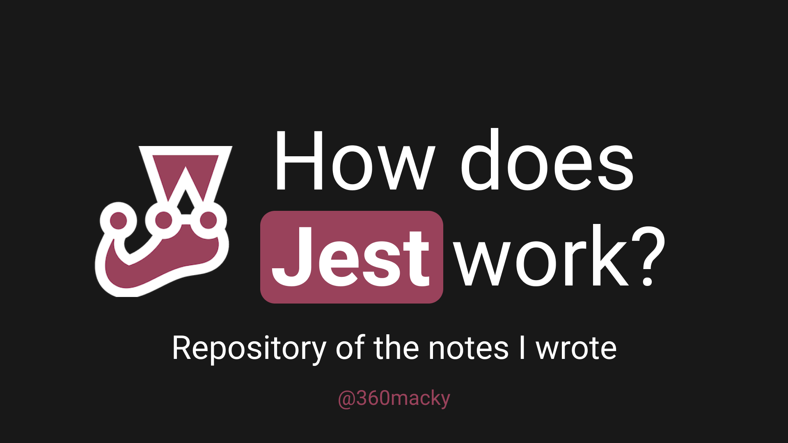

# 🧪 Jest Notes - How does Jest works?



## ✍ About this repository

### 🌌 Purpose of this repository
I consider Unit Testing an important tool to ensure the quality of software functionalities. As a FrontEnd engineer I learned to write tests to check functions, or files. At this moment, all the projects, applications or software products that I have developed are about to incorporate, (or already incorporate) a space dedicated to unit testing with Jest within the file structure.

### 📎 About this notes
This repository is part of the notes that I have written when studying a topic.

If you want more of this content, please follow me on [GitHub](https://github.com/360macky) or [Twitter](https://twitter.com/360macky).

The text is licensed by MIT, the images may be subject to copyright.

## 👀 How to configure the testings?
Using setupFilesAfterEnv settings in package.json.
### How to use setupFilesAfterEnv?

Adding this property to the jest property in package.json, you can specify the path of the file that must be executed to set up the testing framework.

```javascript
    "setupFilesAfterEnv": [
      "<rootDir>/src/__test__/setupTest.js"
    ],
```

## 💥 How to set up Jest for Web?
Modify package.json with:
```javascript
    "testEnvironment": "jsdom"
```
I found this good explaination:
> By default, jest uses the node testEnvironment. This essentially makes any tests meant for a browser environment invalid.. jsdom is an implementation of a browser environment, which supports these types of UI tests.


## 🦾 What are Mocks?
Mocks are simulating functions that our app makes.

## 👨‍🚀 About Enzyme/React
### Where use `mount`, `shallow` or `render`?
- `mount()`: When you need the DOM.
- `shallow()`: When you need something in particular of the component (without the DOM).
- `render()`: When you need to analyze the resulting HTML structure.

## ✨ Jest Options
### How can I watch every test suite in the terminal?
Set verbose property to `true` inside `jest` property inside `package.json` file.
```javascript
"verbose": true,
```

